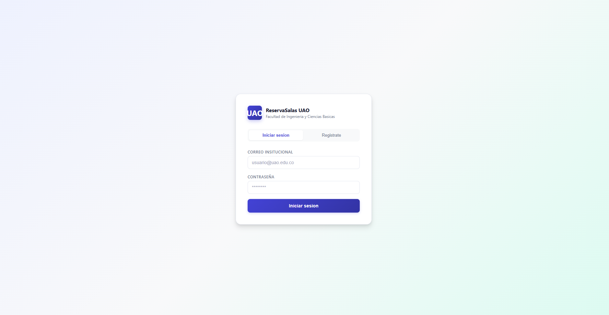
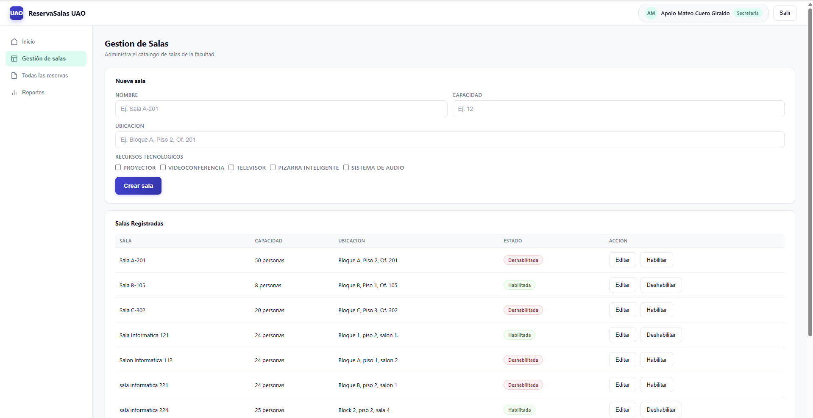
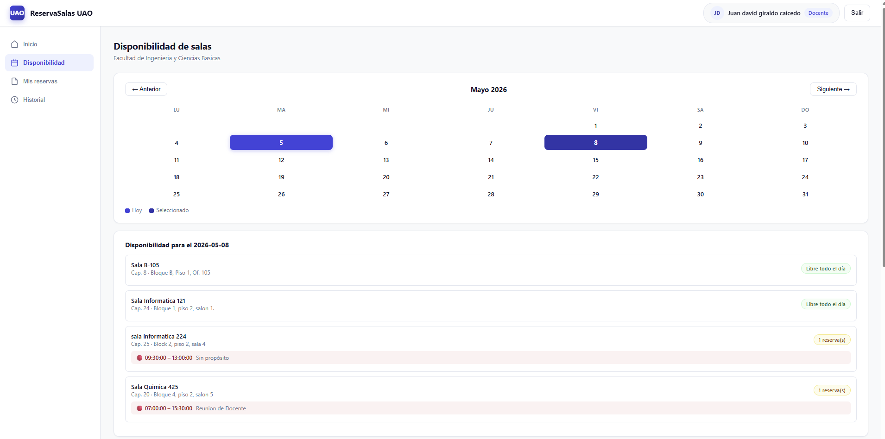

# 🏛️ ReservaSalas UAO
> Meeting Room Reservation Web System — Universidad Autónoma de Occidente


## 📋 Description

Institutional web system developed to manage meeting room reservations for the Faculty of Engineering and Basic Sciences at UAO. It replaces the manual management process using Google Calendar with a centralized platform featuring role-based access control, real-time validation, and full traceability.

## ✨ Features

### 👨‍🏫 Teachers

- Room availability consultation through an interactive calendar
- Real-time reservation creation and cancellation
- Automatic scheduling conflict validation
- Complete reservation history

### 👩‍💼 secretaries

- Full room catalog management (create, edit, enable/disable)
- Technological resources management per room
- Adjustment and cancellation of any reservation
- Report generation by date range
- View of all faculty reservations

## 🛠️ Tech Stack

| Layer         | Technology                   |
|---------------|------------------------------|
| Frontend      | HTML5, CSS3, JavaScript ES6  |
| Backend       | Java 17, Spring Boot 3.5     |
| Database      | MySQL 8.0                    |
| Security      | Spring Security + JWT        |
| ORM           | Spring Data JPA + Hibernate  |

## 🏗️ Architecture

The system implements a **monolithic client-server architecture** with three-layer separation:

Frontend(HTML/CSS/JS)

↕  REST API / JSON

Backend(Spring Boot)
├── Controller -> Expose REST endpoints
├── Service -> Business logic
└── Repository -> Data access (JPA)

↕ JDBC

Database (MySQL)

## 📁 Project Structure

Pagina Web ReservaSalas/

├── reserva-salas /   <-- Backend Spring Boot
| ├── src/main/java/com/uao/reservas_salas/
| | ├── controller/  <-- REST Endpoints
| | ├── service/     <-- Business Logic
| | ├── repository/  <-- Data Acces
| | ├── entity/      <-- JPA Models
| | ├── security/    <-- JWT + Spring Security
| | └── exception/   <-- Error Handing
| └── src/main/resources/
|   └── application.properties.example
└── reservas-salas-frontend  <-- Frontend
├── css/
| └── style/css
├── js/
| ├── api.js         <-- Backend communication
| ├── auth.js        <-- Session management
| ├── app.js         <-- Login & registration
| ├── docente.js     <-- Teacher dashboard
| └──  secretaria.js  <-- Secretary dashboard
├── pages/
| ├── dashboard-docente.html
| └── dashboard-secretaria.html
└──index.html

## ⚙️ Installation & Setup

### Prerequisites

- Java 17+
- Maven 3.8+
- MySQL 8.0+
- Modern browser
- Live server (VS Code) or any static file server

### 1. Database

```sql
-- Run the included SQL script
source reservas_salas_uao.sql;
```

### 2. Backend

```bash
# Clone the repository
git clone https://github.com/YOUR_USERNAME/reservas-salas-uao.git

# Configure credentials
cd reservas-salas
cp src/main/resource/application.properties.example
src/main/resources/application.properties
# Edit application.properties with your local settings

# Run the project
./mvnw spring-boot:run
```

### 3. Frontend

```bash
# Open reservas-salas-frontend with Live Server in VS Code
# Or serve the files with any static file server
# Backend must be running at http://localhost:8080
```

## 🔐 Roles & Access

| Role      | Assignment                                                      | Access                           |
|-----------|-----------------------------------------------------------------|----------------------------------|
| TEACHER   | Automatically assigned upon registration with @uao.edu.co email | View and manage own reservations |
| SECRETARY | Email must be in the pre-defined whitelist                      | Full system administration       |

## 📊 Database Model

The system has 8 main tables:
`usuarios`. `lista_blanca_secretaria`, `facultades`, `salas`, `recursos_tecnologicos`, `sala_recursos`, `reservas`, `auditoria`


## 📌 Business Rules

- Reservations can only be made between **7:00 AM and 9:30 PM**
- **Simultaneous reservations** for the same room are not allowed
- Reservations are **never deleted** — only cancelled (traceability)
- All system actions are logged in an **audit table**
- Past dates cannot be selected when creating a reservation

## 🖥️ Screenshots










## 👥 Developed By

| Name        | Role                 |
|-------------|----------------------|      
| JuanitohDEV | Full Stack Developer |


## 📄 License

This project was developed as a personal project subject — Computer Engineering Program, UAO.

---

⭐ If you found this project useful, consider giving it a star!